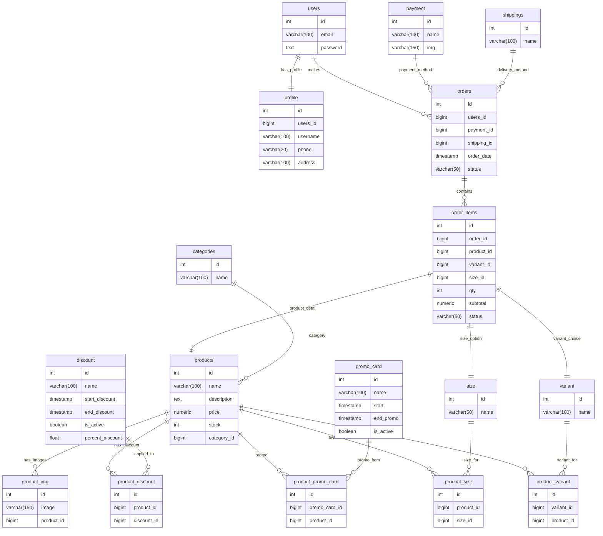

```mermaid
erDiagram

users {
    int id
    varchar(100) email
    text password
}

profile {
    int id
    bigint users_id
    varchar(100) username
    varchar(20) phone
    varchar(100) address
}

payment {
    int id
    varchar(100) name
    varchar(150) img
}

shippings {
    int id
    varchar(100) name
}

orders {
    int id
    bigint users_id
    bigint payment_id
    bigint shipping_id
    timestamp order_date
    varchar(50) status
}

order_items {
    int id
    bigint order_id
    bigint product_id
    bigint variant_id
    bigint size_id
    int qty
    numeric subtotal
    varchar(50) status
}

categories {
    int id
    varchar(100) name
}

products {
    int id
    varchar(100) name
    text description
    numeric price
    int stock
    bigint category_id
}

variant {
    int id
    varchar(100) name
}

size {
    int id
    varchar(50) name
}

discount {
    int id
    varchar(100) name
    timestamp start_discount
    timestamp end_discount
    boolean is_active
    float percent_discount
}

product_discount {
    int id
    bigint product_id
    bigint discount_id
}

product_img {
    int id
    varchar(150) image
    bigint product_id
}

promo_card {
    int id
    varchar(100) name
    timestamp start
    timestamp end_promo
    boolean is_active
}

product_promo_card {
    int id
    bigint promo_card_id
    bigint product_id
}

product_size {
    int id
    bigint product_id
    bigint size_id
}

product_variant {
    int id
    bigint variant_id
    bigint product_id
}

users ||--|| profile : has_profile
users ||--o{ orders : makes
orders ||--o{ order_items : contains
order_items ||--|| products : product_detail
order_items ||--|| variant : variant_choice
order_items ||--|| size : size_option
payment ||--o{ orders : payment_method
shippings ||--o{ orders : delivery_method

categories ||--o{ products : category
products ||--o{ product_img : has_images
products ||--o{ product_discount : has_discount
discount ||--o{ product_discount : applied_to
products ||--o{ product_promo_card : promo
promo_card ||--o{ product_promo_card : promo_item

products ||--o{ product_size : available_in
size ||--o{ product_size : size_for

products ||--o{ product_variant : available_in
variant ||--o{ product_variant : variant_for
```
