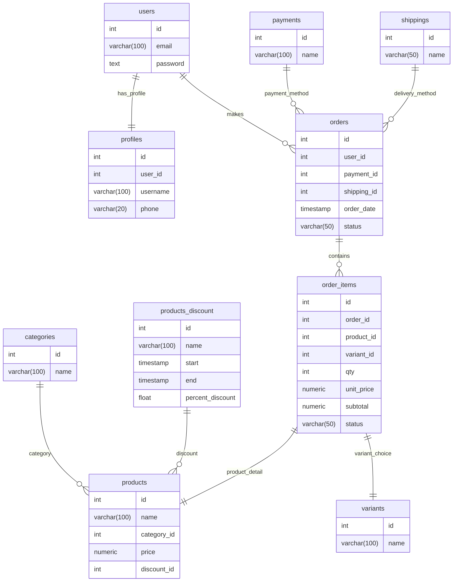

```mermaid
erDiagram

users {
int id
varchar(100) email
text password
}

profiles {
int id
int user_id
varchar(100) username
varchar(20) phone
}

categories {
int id
varchar(100) name
}

products_discount {
int id
varchar(100) name
timestamp start
timestamp end
float percent_discount
}

products {
int id
varchar(100) name
int category_id
numeric price
int discount_id
}

variants {
int id
varchar(100) name
}

payments {
int id
varchar(100) name
}

shippings {
int id
varchar(50) name
}

orders {
int id
int user_id
int payment_id
int shipping_id
timestamp order_date
varchar(50) status
}

order_items {
int id
int order_id
int product_id
int variant_id
int qty
numeric unit_price
numeric subtotal
varchar(50) status
}

users ||--|| profiles : has_profile
users ||--o{ orders : makes
orders ||--o{ order_items : contains
order_items ||--|| products : product_detail
order_items ||--|| variants : variant_choice
payments ||--o{ orders : payment_method
shippings ||--o{ orders : delivery_method
categories ||--o{ products : category
products_discount ||--o{ products : discount
```
